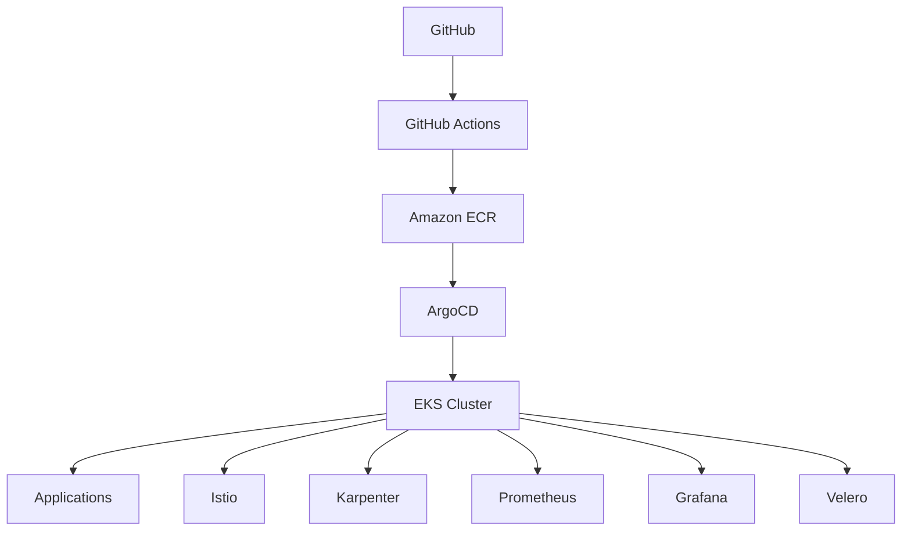

# 🚀 EKS GitOps Platform

> Production-grade AWS EKS Platform powered by Terraform, GitOps, ArgoCD, Istio, Karpenter, GitHub Actions and Observability.


---

## 📖 Overview

This repository demonstrates how to build, secure, automate and operate a production-ready Kubernetes platform on AWS.

The architecture follows modern Platform Engineering principles:

- Infrastructure as Code (Terraform)
- GitOps Deployments (ArgoCD)
- Kubernetes-native operations
- Service Mesh Security (Istio)
- Automated CI/CD
- Cluster Autoscaling (Karpenter)
- Disaster Recovery (Velero)
- Observability (Prometheus + Grafana)

---

## 🏗 Architecture



---

## ⚙️ Technology Stack

### Cloud
- AWS
- Amazon EKS
- Amazon ECR
- IAM
- ALB

### Platform
- Kubernetes
- Helm
- ArgoCD
- Istio
- Karpenter

### Automation
- Terraform
- GitHub Actions
- Shell Scripts

### Observability
- Prometheus
- Grafana
- OpenTelemetry

### Security
- Trivy
- Cosign
- mTLS
- RBAC

---

## 📂 Planned Repository Structure

```text
terraform/
argocd/
kubernetes/
helm/
monitoring/
security/
github-actions/
docs/
architecture/
```

---

## 🎯 Business Outcomes

- Support 100+ microservices
- Reduce deployment time through GitOps automation
- Improve cluster utilization using Karpenter
- Enable secure service communication with Istio mTLS
- Implement enterprise-grade disaster recovery

---

## 🗺 Roadmap

- [ ] Terraform VPC Module
- [ ] EKS Cluster Module
- [ ] ArgoCD Bootstrap
- [ ] GitHub Actions CI Pipeline
- [ ] GitHub Actions CD Pipeline
- [ ] Istio Service Mesh
- [ ] Velero Backup Strategy
- [ ] Prometheus & Grafana Stack
- [ ] Security Hardening Guide
- [ ] Cost Optimization Guide

---

## 👨‍💻 Author

Kanakaraj Vetti

DevOps Engineer | AWS | Azure | Kubernetes | Platform Engineering